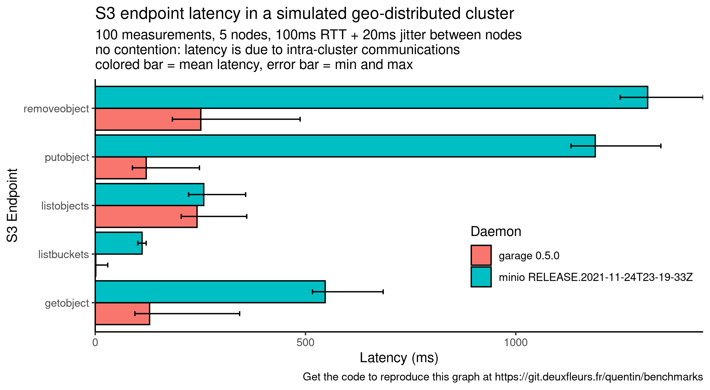
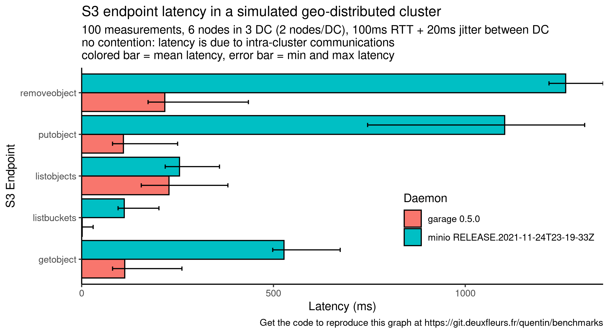

# Benchmarks

With Garage, we wanted to build a software defined storage service that follow the [KISS principle](https://en.wikipedia.org/wiki/KISS_principle),
 that is suitable for geo-distributed deployments and more generally that would work well for community hosting (like a Mastodon instance).

In our benchmarks, we aim to quantify how Garage performs on these goals compared to the other available solutions.

## Geo-distribution

The main challenge in a geo-distributed setup is latency between nodes of the cluster.
The more a user request will require intra-cluster requests to complete, the more its latency will increase.
This is especially true for sequential requests: requests that must wait the result of another request to be sent.
We designed Garage without consensus algorithms (eg. Paxos or Raft) to minimize the number of sequential and parallel requests.

This serie of benchmarks quantifies the impact of this design choice.

### On a simple simulated network

We start with a controlled environment, all the instances are running on the same (powerful enough) machine.

To control the network latency, we simulate the network with [mknet](https://git.deuxfleurs.fr/trinity-1686a/mknet) (a tool we developped, based on `tc` and the linux network stack).
To mesure S3 endpoints latency, we use our own tool [s3lat](https://git.deuxfleurs.fr/quentin/s3lat/) to observe only the intra-cluster latency and not some contention on the nodes (CPU, RAM, disk I/O, network bandwidth, etc.).
Compared to other benchmark tools, S3Lat sends only one (small) request at the same time and measures its latency.
We selected 5 standard endpoints that are often in the critical path: ListBuckets, ListObjects, GetObject, PutObject and RemoveObject.

In this first benchmark, we consider 5 instances that are located in a different place each. To simulate the distance, we configure mknet with a RTT between each node of 100 ms +/- 20 ms of jitter. We get the following graph, where the colored bars represent the mean latency while the error bars the minimum and maximum one:

Compared to garage, minio latency drastically increases on 3 endpoints: GetObject, PutObject, RemoveObject.

We suppose that these requests on minio make transactions over Raft, involving 4 sequential requests: 1) sending the message to the leader, 2) having the leader dispatch it to the other nodes, 3) waiting for the confirmation of followers and finally 4) commiting it. With our current configuration, one Raft transaction will take around 400 ms. GetObject seems to correlate to 1 transaction while PutObject and RemoveObject seems to correlate to 2 or 3. Reviewing minio code would be required to confirm this hypothesis.

Conversely, garage uses an architecture similar to DynamoDB and never require global cluster coordination to answer a request.
Instead, garage can always contact the right node in charge of the requested data, and can answer in as low as one request in the case of GetObject and PutObject. We also observed that Garage latency, while often lower to minio, is more dispersed: garage is still in beta and has not received any performance optimization yet.

As a conclusion, Garage performs well in such setup while minio will be hard to use, especially for interactive use cases.

### On a complex simulated network

This time we consider a more heterogeneous network with 6 servers spread in 3 datacenter, giving us 2 servers per datacenters.
We consider that intra-DC communications are now very cheap with a latency of 0.5ms and without any jitter.
The inter-DC remains costly with the same value as before (100ms +/- 20ms of jitter).
We plot a similar graph as before:

This new graph is very similar to the one before, neither minio or garage seems to benefit from this new topology, but they also do not suffer from it.

Considering garage, this is expected: nodes in the same DC are put in the same zone, and then data are spread on different zones for data resiliency and availaibility.
Then, in the default mode, requesting data requires to query at least 2 zones to be sure that we have the most up to date information.
These requests will involve at least one inter-DC communication.
In other words, we prioritize data availability and synchronization over raw performances.

Minio's case is a bit different as by default a minio cluster is not location aware, so we can't explain its performances through location awareness.
*We know that minio has a multi site mode but it is definitely not a first class citizen: data are asynchronously replicated from one minio cluster to another.*
We suppose that, due to the consensus, for many of its requests minio will wait for a response of the majority of the server, also involving inter-DC communications.

As a conclusion, our new topology did not influence garage or minio performances, confirming that in presence of latency, garage is the best fit.

### On a real world deployment

*TODO*

## Performance stability

A storage cluster will encounter different scenario over its life, many of them will not be predictable.
In this context, we argue that, more than peak performances, we should seek predictable and stable performances to ensure data availability.

### Reference

*TODO*

### On a degraded cluster

*TODO*

### At scale

*TODO*
